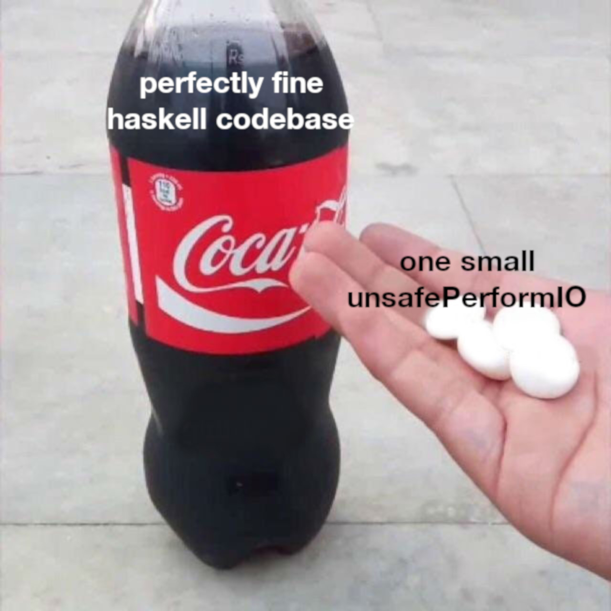

---
title: 'patat'
author: 'Jasper Van der Jeugt'
date: 2018-10-12
patat:
  incrementalLists: true
  slideLevel: 2
  wrap: true
  images:
    backend: w3m
...

# Patat

## patat

The application you see right now.

<!-- Comment -->

. . .

**P**resentations **A**top **T**he **A**nsi **T**erminal

. . .

<https://github.com/jaspervdj/patat>

. . .

_patat_ also means potato in Flemish dialect; in Dutch it means French Fries.


# Why

## Version Control

_Version control_ is probably one of the most useful things in computing

. . .

I want version control for most things in my life:

- Invoices / receipts...
- Password manager (`pass`)
- TODO lists
- dotfiles...

## Why not LaTeX beamer?

LaTex is hard to write and read:

```latex
Common (sane) configuration use cases of JSON are already: \\
\vspaced
\begin{itemize}
\item Immutable
\item \emph{Mostly} typed
\end{itemize}
\vspaced
```

## Why not LaTeX beamer?

Markdown is easy to write and read

```
Common (sane) configuration use cases of JSON are already:

- Immutable
- _Mostly_ typed
```

## Why not LaTeX beamer?

"Macros can help with this"

## Why in the terminal?

There are two reasons for this:

1. It makes you look super cool

2. Easier switching between terminal/console during ad-hoc presentations

## Why in the terminal?

I used to do a lot of internal presentations at work.  I want to show some
slides and do a quick demo in the terminal.

. . .

Video conferencing software lets you share either one window or your entire
monitor.

. . .

There are good reasons for not sharing your entire monitor.

## Why did I write this?

I used to use `mdp`.  I don't rave about it but it's okay.

. . .

I was preparing a presentation and there was a bug in the markdown parser and I
couldn't work around that.

. . .

The parser was handwritten in C...

## Why did I write this?

Seemed like a fun project, it shouldn't take more than a few hours if I use
`pandoc` for the parsing.

. . .

This claim turned out to be correct (for an MVP version of it at least)

. . .

But then users requested features and I was happy to oblige...

# Features

## Pandoc!

- Markdown
- Syntax highlighting
- Literate Haskell
- Org Mode
- ...
- LaTeX?

## Easy to write

    # This is a slide title

    This is the slide contents.

## Live reload

You can preview slides as you are writing them.

Hello Haskell eXchange!

## More stuff

- Auto-advancing
- Themes
- Wrapping and margins
- Fragments
- ...

## Images



# Implementation: Haskell

## Haskell implementation

Should be no surprise

. . .

Very "simple" Haskell 98, refreshing and easy to work on

. . .

Example: Pretty printers are well-studied in Haskell, and compose well, even
with additional features like syntax highlighting and margins

. . .

This is true for the rest of the application as well: it easy to add new
features without them destroying the rest of the codebase -- Haskell composes
well.

## Example: fragments

`Display.hs`:

```haskell
displaySlide :: Slide -> IO ()
```

. . .

Fragments can be used to e.g. separate really bad intros to jokes from their
unbelievably lame punchlines:


    Is there a good way to avoid null pointers?

    . . .

    Maybe

## Example: fragments

`Display.hs`:

```haskell
displaySlide :: Slide -> IO ()
```

Pure code:

```haskell
splitFragments :: [Slide] -> [[Slide]]
```

# Questions?
