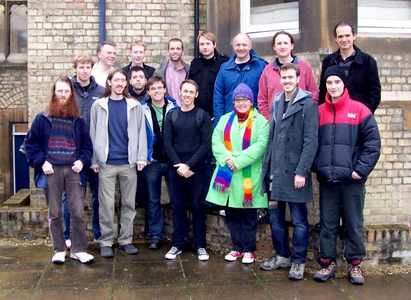
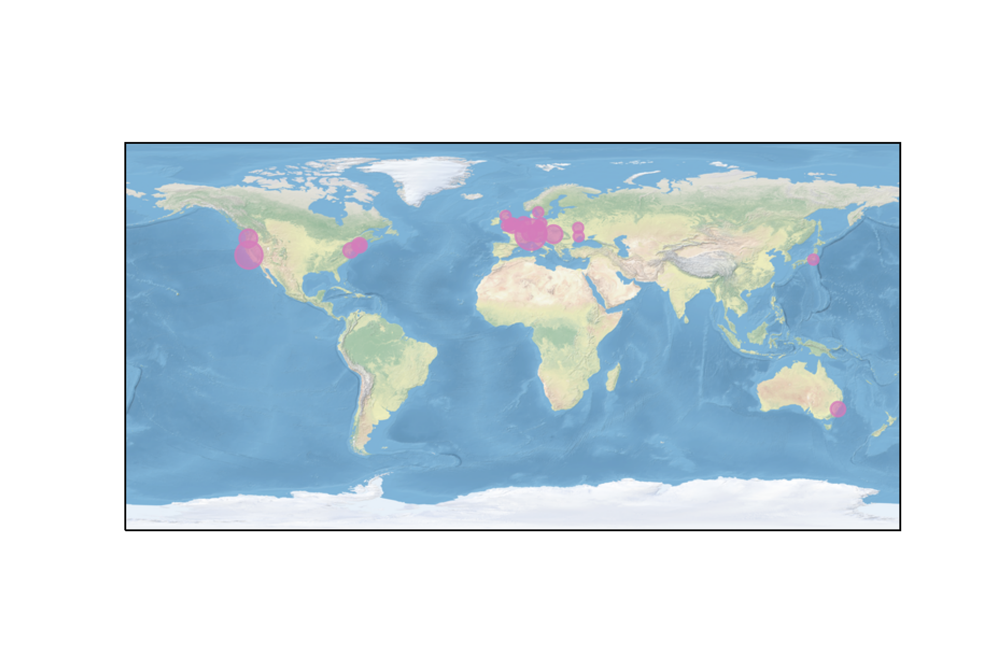
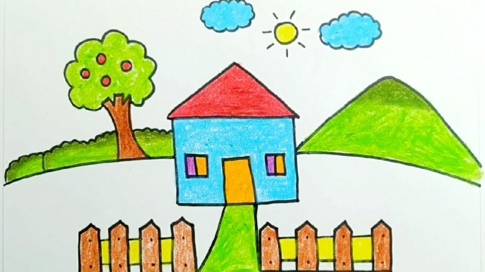
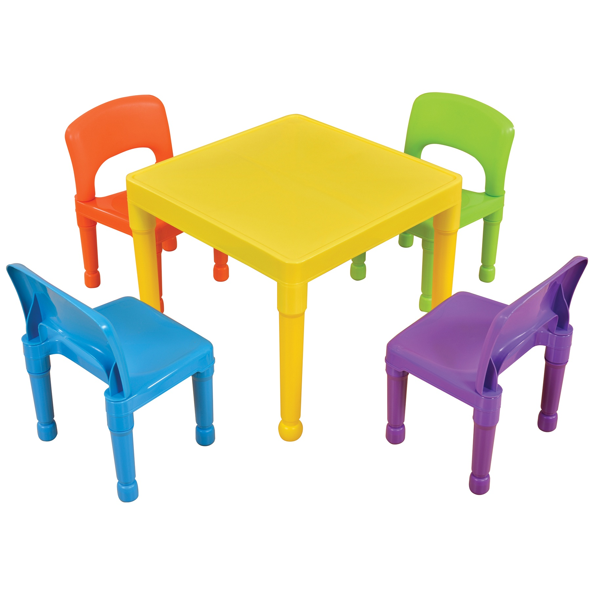
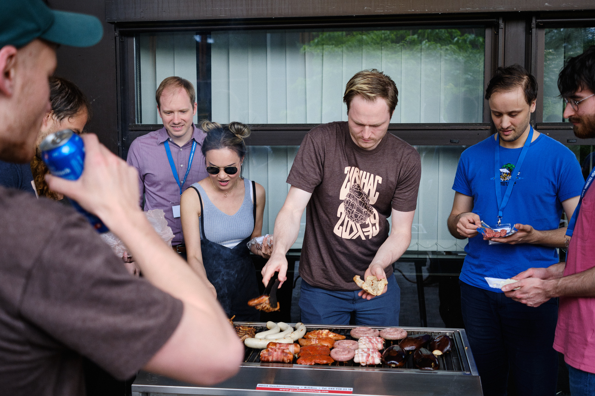
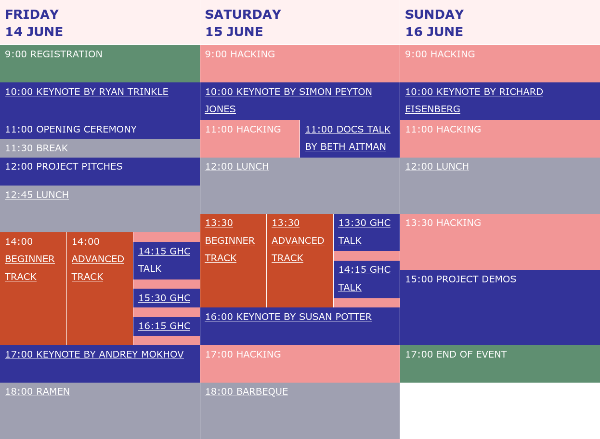
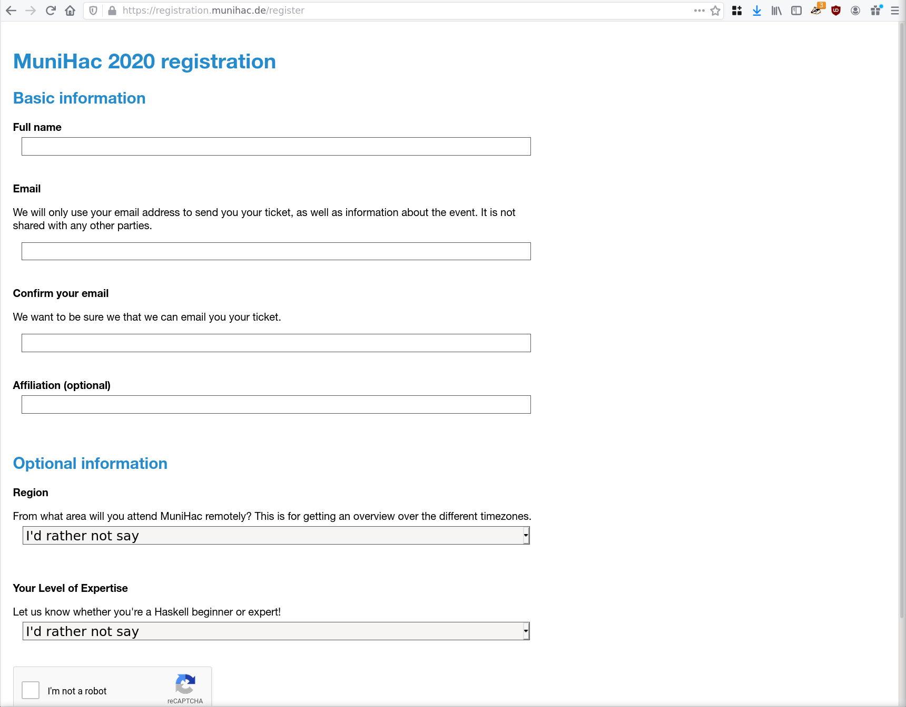
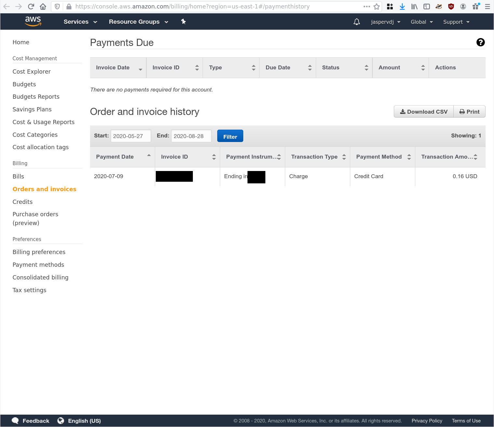

---
title: Organize a Haskell Hackathon
author: Jasper Van der Jeugt
patat:
  incrementalLists: true
  wrap: true
  images:
    backend: w3m
...

# Brief History of Hackathons

## Introduction

Hello, I'm Jasper

. . .

I am a longtime Haskell user, both for fun as well as for profit

. . .

I've been one of the main ZuriHac organizers for the few years, and I also
organized a Hackathon in Belgium back in 2010

## What's this talk about?

 -  Brief History of Hackathons
 -  Interview with Don Stewart
 -  How do I organize a Hackathon?

## What's a Haskell Hackathon

 -  Academic Conferences
     *  ICFP
     *  POPL
     *  ...
 -  Non-Academic Conferences
     *  Haskell eXchange
     *  Haskell Love
     *  f(by)
     *  Compose Conference
     *  ...
 -  Meetups in many big cities
 -  Hackathons

## What's a Haskell Hackathon

> The Haskell Hackathon is an international, grassroots collaborative coding
> festival with a simple focus: build and improve Haskell libraries, tools, and
> infrastructure.
>
> This is a great opportunity to meet your fellow Haskellers in real life, find
> new contributors for your project, improve existing libraries and tools or
> even start new ones!
>
> This event is open to any experience level, from beginners to gurus. In
> fact, one of the goals is to bring beginners in contact with experts so that
> the former can get a quick start in the Haskell community. We will have a
> dedicated beginners' track, and there are going to be mentors on site whom you
> can directly approach during the whole event with any Haskell-related question
> that might pop up.

## What's a Haskell Hackathon

Why do we have Haskell Hackathons?

## Initial announcement

> Following the success of the GHC Hackathon at ICFP, we are pleased to announce
> the inaugural Haskell Hackathon, Hac 2007!
> 
> The event will be held over 3 days, January 10-12 2007, at the Oxford
> University Computing Laboratory, in the UK.
> 
> The plan is to hack on Haskell infrastructure, tools, libraries and compilers.
> To attend please register, and get ready to hack those lambdas!
> 
> Code to hack on:
> 
>     * Hackage
>     * Cabal
>     * Porting foreign libraries
>     * Porting compilers
>     * Bug squashing
>     * Performance improvements to compilers
>     * You decide!
> 
> Registration:
> 
> ...

## Hac 2007

## MuniHac 2019

## Hac 2-7

It's a bit like a traveling Circus

------  ------------  ----
Hac     Oxford        2007
Hac II  Freiburg      2007
HaL3?   Leipzig       2008
Hac4    Gothenburg    2008
Hac5    Utrecht       2009
Hac φ   Philadelphia  2009
Hac7    Edinburgh     2009
HacPDX  Portland      2009
------  ------------  ----

## List of hackathons

-------------------------  --------------------------
AusHac                     Hac Boston
BayHac                     HacFreiburg
BelHac                     Hac II
Bristol Haskell Hackathon  HacPDX
Budapest Hackathon         Hac φ
CamHac                     HakkuTaikai
DHD UHac                   HaL3
GHC hackathon              Haskell eXchange Hackathon
Hac                        LtU-Kiev Hackathon
Hac4                       MuniHac
Hac5                       OdHac
Hac7                       ZuriHac
Hac Berlin
-------------------------  --------------------------

## Hackathons over the years

    2006  ###########
    2007  ######################
    2008  ######################
    2009  ############################################
    2010  ############################################
    2011  #######################################################
    2012  ###########
    2013  #################################
    2014  ##################################################################
    2015  ############################################
    2016  #######################################################
    2017  ############################################
    2018  #################################
    2019  ######################
    2020  #################################

## World map

# Special guest Don Stewart

## Interview

# How do I organize a Hackathon?

## What do you need?

## What do you need?

## What do you need?

## What do you need?

## What do you need?

That's it!

## Finding a building

There's basically two options:

 -  Universities
 -  Companies

## Rough timeline

It's nice to have some dates set.

## Committee

_T-minus 9-10 months_

Who are we?  Who does what?

## Website

_T-minus 9 months_

The website is the single source of truth

. . .

(A shared google doc is the second source of truth)

## Speakers

Community is definitely more important than the talks

. . .

But they are very valuable!

## Speakers

_T-minus 9 months_

You can do a Call for Proposal or invite people directly

## Registration

_T-minus 6 months_

Website has details, and people should be able to register.

## Projects

_T-minus 6 months_

What projects are people going to work on?

. . .

 -  Registration
 -  Project Pitches
 -  Project Presentations

## Sponsors

_T-minus 4 months_

For most sponsors, it's really all about recruiting

. . .

 -  Logo on website
 -  Mention in announcements
 -  Elevator pitch at opening presentation
 -  Logo on T-shirts
 -  ...

## T-Shirts

_T-minus 2 months_

Obviously optional, it's a high cost.

. . .

Ask for sizes in registration + extrapolate

## Food

_T-minus 2 months_

Haskellers need food.

. . .

 -  Restaurant at location
 -  Go out to restaurants!
 -  Have food provided
 -  Do a BBQ

## Barbeque

## Schedule

_T-minus 1 month_

## Schedule

## Social Events

Doesn't need to be fancy.

. . .

Go to a pub together.

. . .

Alternatively a drink at the local lake.

## Event

Don't plan on working on too much stuff yourself.

## Zureg

<https://github.com/zfoh/zureg/>

Solves some issues:

 -  Manual registration process
 -  Having everyone confirm their registration
 -  Privacy.
 -  Emailing people.  Not everyone has a Google account.

## Zureg

## Zureg

 -  Pretty simple to set up if you know AWS
 -  Pretty simple to set up if you don't know AWS
 -  Some odd design choices but very cheap to run

## Zureg

## Scholarships

2019: ~10 sponsorships for 500CHF

## Association

Do you need a legal entity?

. . .

Probably not.

. . .

But it's useful for more things than a Hackathon.

## Virtual Event

This year ZuriHac was a virtual event!

 -  Discord is good
 -  Streamyard is good

## ZuriHac 2021

Hopefully in real life!

. . .

18-20 June 2021

. . .

Speaker: Emily Pillmore!

# Questions?
